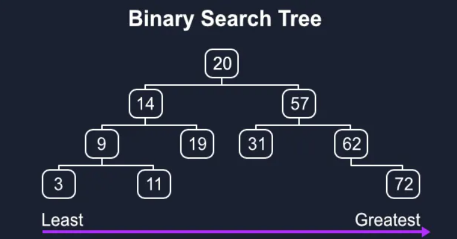
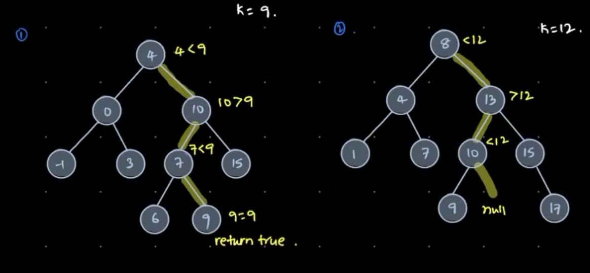

# Binary Search Tree
- A Binary Tree is said to be BST if 
    - All nodes in `Left Sub Tree` are smaller than root
    - All nodes in `Right Sub Tree` are greater than root

    


## Properties
- If Root is NULL then it is a BST
- In a BST, All Nodes have distince values
- In a BST, Data is sorted in increasing order(Inorder Traversal)


## Searching in a BST



```c++
Iterative
bool search(Node* root, int target) {
    Node* current = root;
    while (root) {
        if (root->data == target) 
            return true;
        if (root->data < target)
            root = root->right;
        else 
            root = root->left;
    }
    return false;
}

// Time Complexity - O(Height of the tree)
// Space Complexity - O(1)


bool searchRecursive(Node* root, int target) {
    if (!root)
        return false;
    if(root->data == target)
        return true;
    if (root->data < target)
        searchRecursive(root->right, target);
    else
        searchRecursive(root->left, target);
}


```

