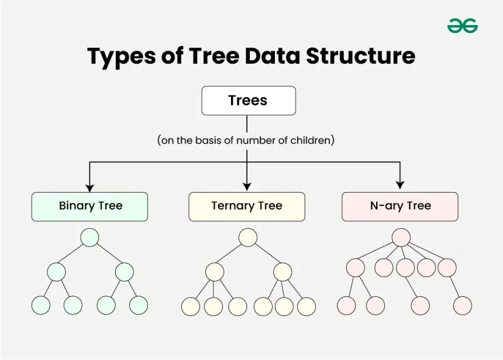
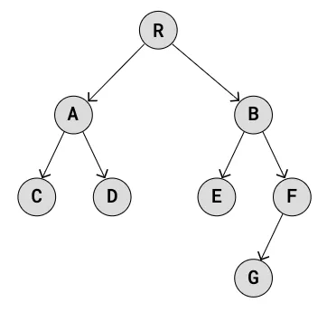
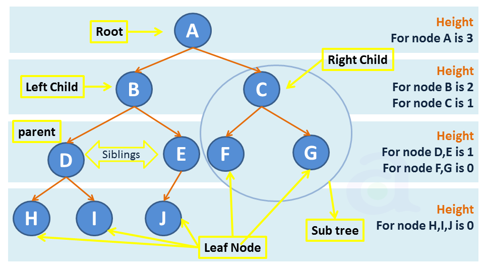
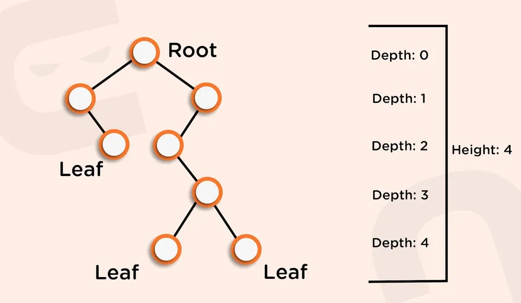
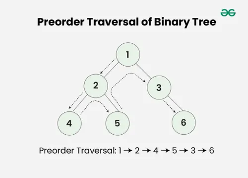
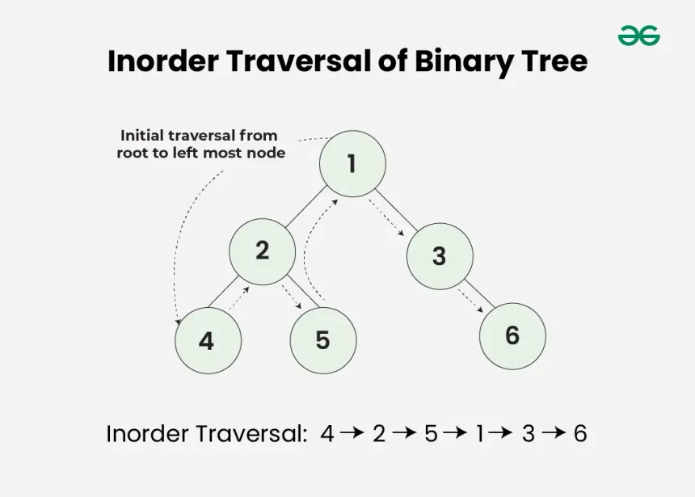
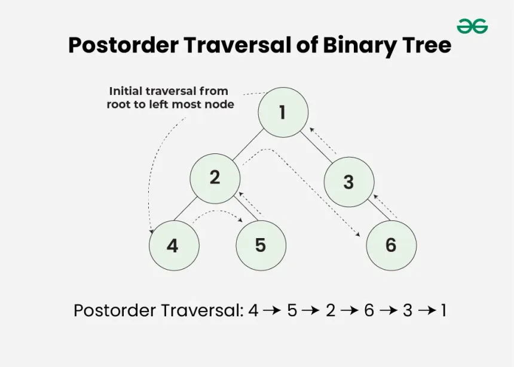

# [Trees](Trees.cpp)
- [Introduction](#introduction)
- [Traversals](#tree-traversals)
- [Resources](#resources)

## Introduction

- A tree is a non-linear hierarchical data structure that consists of nodes connected by edges.
- In a tree, Every element is a node
    
- Binary Trees
    - Every node must have maximum of 2 children only i.e, 0-2.
    

### Structure of a Binary Tree
```c++
class Node {
public:
    int data = 0;
    Node *left;
    Node *right;

    Node(int data) {
        this->data = data;
        this->left = NULL;
        this->right = NULL;
    }
};
```

### Height of a Tree
- Length of the longest path from the `root` to any of its `descendent leaf node`.
- Height of any leaf node is 0

- Height of a node
    - Length of the longest path from the node to any of its descendent leaf node.
    - 1 + Max(height of its left child, height of its right child)
- Depth of a node
    - Length of the path from `root` to the `node`
    - Depth of Root is 0.
    


## Tree Traversals
There are three traversals of a tree
- PreOrder Traversal
- InOrder Traversal
- PostOrder Traversal

### PreOrder Traversal
- Order of Execution: Root-Left-Right

```cpp
void preOrderTraversal(Node *root) {
    if (root == NULL)
        return;
    cout << root->data << " "; // Root
    preOrderTraversal(root->left); // Left
    preOrderTraversal(root->right); // Right
}
```

### InOrder Traversal
- Order of Execution: Left-Root-Right

```cpp
void inOrderTraversal(Node *root) {
    if (root == NULL)
        return;
    inOrderTraversal(root->left); //Left
    cout << root->data << " ";  // Root
    inOrderTraversal(root->right); // Right
}
```


### PostOrder Traversal
- Order of Execution: Left-Right-Root

```cpp
void postOrderTraversal(Node *root) {
    if (root == NULL)
        return;
    postOrderTraversal(root->left); //Left
    postOrderTraversal(root->right); // Right
    cout << root->data << " "; // Root
}
```


## Resources
- [Programmiz](https://www.programiz.com/dsa/trees)
- [W3Schools](https://www.w3schools.com/dsa/dsa_theory_trees.php)