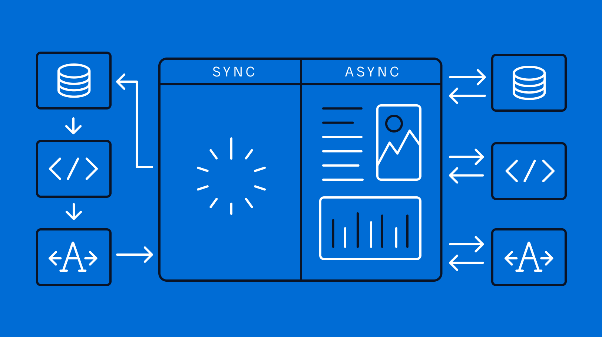

# [Asynchronous CallBacks](./5.js)

- [Synchronous & Asynchronous Programming](#synchronous-and-asynchronous-programming)
- [CallBacks](#callbacks)
- [Async Function Using Builtin Modules]()
- [Event Loop]()
- [Parallel Async Operations]()
- [Resources](#resources)

## Synchronous And Asynchronous Programming
### Synchronous Programming
Synchronous is a blocking architecture, so the execution of each operation depends on completing the one before it. Each task requires an answer before moving on to the next iteration.
- Sync is a single-thread, so only one operation or program will run at a time.
- Sync is blocking — it will only send the server one request at a time and wait for that request to be answered by the server.
- Sync is slower and more methodical.

```javascript
function Alpha() {
    console.log("Alpha");
}

function Beta() {
    console.log("Beta");
}

// This function has wait time of 3 seconds which blocks Beta function to execute.
function sync() {
    console.log("Sync has Started");
    const start = Date.now();
    while((Date.now() - start) < 3000) {
        // Wait for 3 Seconds
    }
    console.log("Sync Ended");
}

Alpha();
sync();
Beta();
```

### Asynchronous Programming
Asynchronous is a non-blocking architecture, so the execution of one task isn’t dependent on another. Tasks can run simultaneously.
- Async is multi-thread, which means operations or programs can run in parallel.
- Async is non-blocking, which means it will send multiple requests to a server.
- Async increases throughput because multiple operations can run at the same time.

```javascript
function Alpha() {
    console.log("Alpha");
}

function Beta() {
    console.log("Beta");
}

// Beta executes even when this function has not ended
function Async() {
    console.log("Async has started");
    setTimeout(() => {
        console.log("Async Ended");
    }, 3000);
}

Alpha();
Async();
Beta();
```


## CallBacks


## Resources
- [Sync VS Async](https://www.freecodecamp.org/news/synchronous-vs-asynchronous-in-javascript/)
- [Mendix-Blog](https://www.mendix.com/blog/asynchronous-vs-synchronous-programming/)
- [Pieces-Blog](https://code.pieces.app/blog/synchronous-and-asynchronous-programming-in-javascript)
- [Event-Loops](https://www.loginradius.com/blog/engineering/understanding-event-loop/)
- [Event-Loops](https://www.educative.io/answers/what-is-an-event-loop-in-javascript)